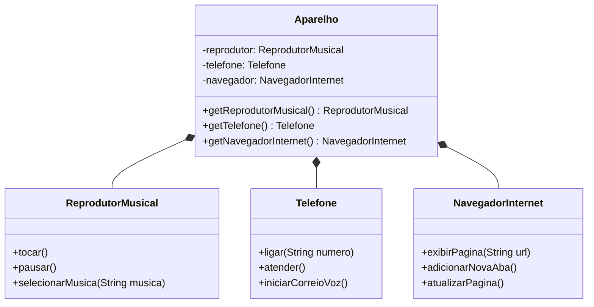

## Diagrama de classes

```mermaid
classDiagram
    class ReprodutorMusical {
        +tocar()
        +pausar()
        +selecionarMusica(String musica)
    }
    class Telefone {
        +ligar(String numero)
        +atender()
        +iniciarCorreioVoz()
    }
    class NavegadorInternet {
        +exibirPagina(String url)
        +adicionarNovaAba()
        +atualizarPagina()
    }
    class Aparelho {
        -reprodutor: ReprodutorMusical
        -telefone: Telefone
        -navegador: NavegadorInternet
        +getReprodutorMusical() ReprodutorMusical
        +getTelefone() Telefone
        +getNavegadorInternet() NavegadorInternet
    }
    Aparelho *-- ReprodutorMusical
    Aparelho *-- Telefone
    Aparelho *-- NavegadorInternet
```